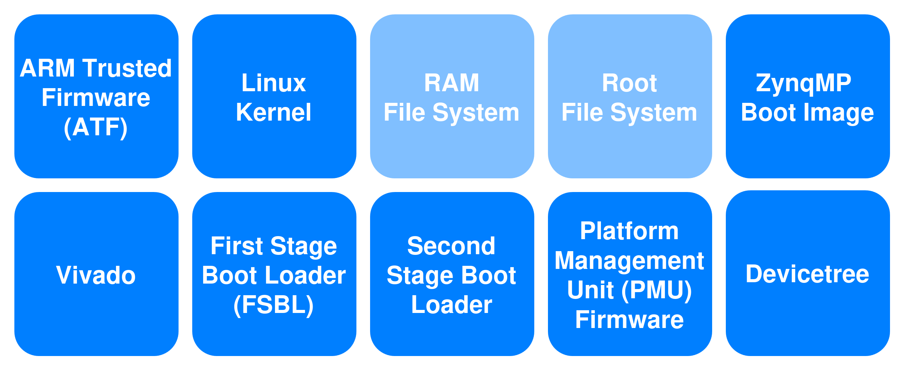
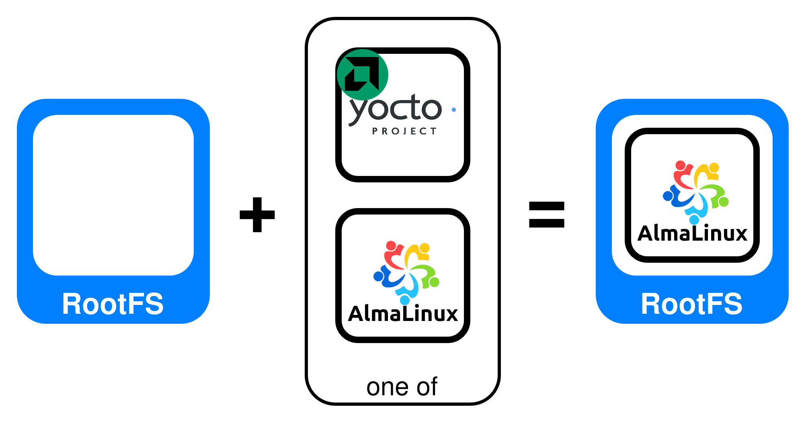
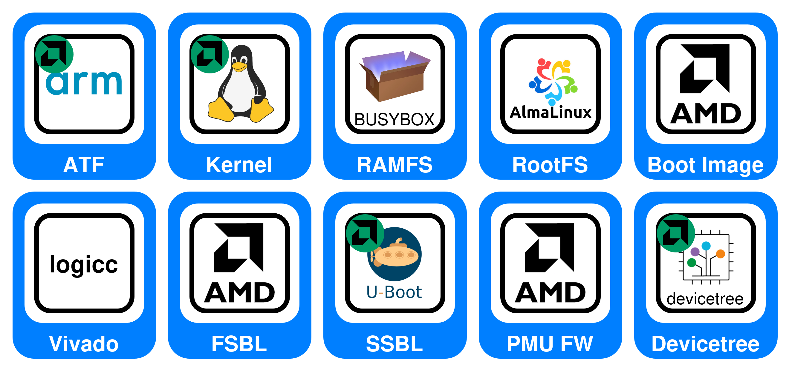
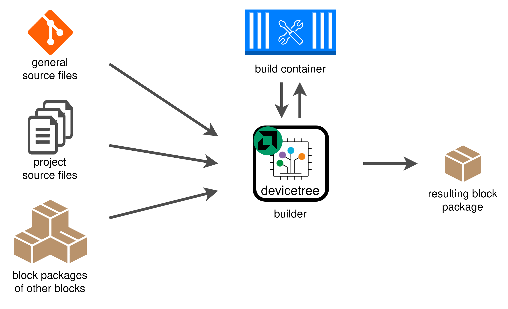

# SoCks (SoC Blocks)

SoCks (short for SoC blocks) is a lightweight and modular framework to build complete embedded Linux images for SoC devices. Currently, the framework focuses on AMD Xilinx ZynqMP devices, but also offers experimental support for AMD Xilinx Versal devices.

## Quick start

### Installation

SoCks is available as a python package, but currently only in this repo and not in a software repository like PyPI. This might change in the future.

It is recommended to install SoCks in a python environment. You can create a new one with the following command:
```
$ python3.10 -m venv ~/py_envs/socks
```

In the python environment run:
```
$ cd <THIS REPO>/tool
$ pip install -U .
```

For a development installation use the following commands instead:
```
$ cd <THIS REPO>/tool
$ pip install -e .
```

### Building an image

This section assumes that you already have a SoCks project. To be able to use the SoCks command you have to be in a SoCks project directory (A directory that contains `project.yml`).
In such a directory you can run the following command to build the full image:
```
$ socks all build
```
It is also possible to build individual blocks with:
```
$ socks <BLOCK> build
```
If you need further assistance you can put `--help` behind every sub-command. E.g. like this:
```
$ socks --help
$ socks fsbl --help
```
SoCks supports tab completion, but you have to enable it manually in every new shell with the following command:
```
$ eval "$(register-python-argcomplete socks)"
```

## Background

SoCks is designed as a lightweigtht framework to build production-ready SoC images. It aims at beeing as transparent as possible by hiding nothing and using internal "smartness" only where it is really needed. Furthermore, SoCks provides understandable and comprehensive warnings and error messages that support you in finding the root cause of a problem as quickly as possible. To achive this while not flooding you with information, SoCks uses the simple approach of divide and conquer. The SoC image is partitioned into a small number of so called blocks that represent a mostly self-contained unit each. Examples are the Vivado block, boot loader blocks or the Linux Kernel block. SoCks builds one block after the other and uses so called block packages as a uniform interface to pass files from one block to another, when needed.

This approach gives full controll to the developer, which enables a reliable and fast build process for the SoC image, a quick process to develop updates, and full compatibility and freedome when it comes to gitlab CI/CD integration. All of this is especially handy if you have to provide support for a system that is deployed in the field and fulfills a mission critcal task.

The main downside of full controll is that setting up a new SoCks project from scratch requires detailed knowledge of the platform you are developing for and the software stack that you want to deploy. So, if your aim is to do rapid prototyping or to explore a new SoC architecture, SoCks is probably not the right tool for you. But if you are an experienced SoC developer that wants to know exactly what is going, SoCks is exactly what you are looking for!

### Basics

SoCks uses a modular approach to build SoC images. To achieve this, the image is partitioned into sections, called blocks. The following image shows the partitioning of an AMD ZynqMP image:



The blocks `RAM File System` and `RAM File System` are slightly grayed out, because they are optional. An image can utilize only a RAMFS, only a RootFS or both. But at least one of the two components is always required.

Each block represents a separate sub-project that can be regarded as largely independent. All blocks have their own source files, their own build process where they utilize dedicated build tools, and they produce their own output files. But of cause there are build time dependencies between the blocks. For example, some blocks use the output files of other blocks as sources of information. To enable the transfer of such information, all blocks contain interfaces to import and export so called block packages.

To unlock the full potential of the modular approach of SoCks, it must be possible to exchange how each block is build. For this purpose, SoCks uses so calles builders. A builder is implemented as a python class and defines how a block is build, which tools are used in the process, which sources are utilized, and which output products are generated. At build time, exactly one builder must be assigned to each block. The following image shows the selection of a builder for the RootFS block:



The AlmaLinux builder that is selected in the image uses qemu and dnf to build the file system for the target platform. Furthermore, it expects a certain set of configuration files that specify for instance which repos should be used, which additional packages should be installed on top of the base installation, which additional files should be add, which systemd services should be enabled, etc.. If one wants to use a Yocto or PetaLinux file system instead, there is the yocto builder that can be used instead. This builder requires a entirely different set of repos, build tools and configuration files, but the output of both builders will the exchangable. Both of them generate an archive that contains the compressed root file system, so they are both valid root file system builders.

The pictograms of the builds show which version of the block they build. The AlmaLinux builder uses official AlmaLinux sources to build the root file system, while the yocto builder uses the AMD version of yocto sources to build a PetaLinux root file system that is specifically tailored for AMD SoCs.

The following image shows a full ZynqMP image with builders assigned to all blocks.



The configuration of a SoCks project is done in a single file: `project.yml`. This file contains global settings that apply to all blocks, like the version of the Vivado toolset or the containerization tool to be use, but it also contains a section for every block that is needed for the SoC image it describes. The section of a block contains for instance which builder is to be used to build this block.

### Builders

Builders are a core component of the SoCks framework. They bundle the mechanisms needed to build a specific version of a block in a python class and therefore allow to automate the process. All of them follow the same overarching pattern, which is presented below:



The builders of the blocks however have only access to the global information and to the information that is dedicated to the block they are building. 

Builders can collect source information from multiple places. Every builder has access to a subset of the information in the file `project.yml`, that configures the SoCks project. The access is limited to the global information in this file and to the information that is dedicated to the block this builder is building. The primary source of input is in most cases a git repository. This git repository can be automaticaly downoaded by SoCks or the user can provide a local folder that contains the equivalent files. Furthermore, most blocks require additional files with information. This can be a dnf config file that is used while building the files system, a template file that is used by SoCks to build the boot image or patches that are applied to the downloaded repo. Such patches allow to save modifications to the content of a git repository if one is not allowed to push to it. Finally, most builders use block backages of other blocks as input. One example is the block packages of the Vivado block, which contains amongst other things the XSA file. The blocks devicetree, FSBL, and PMU Firmware need the Vivado block package as input to be able to extract the ZynqMP PS configuration from the XSA file. The builder checks the content of the block package during the import process and raises an error if it does not contain all expected files.

In addition, a builders also needs a set of tools to be able to build the source files into output files. SoCks uses containers to provide the block with these tools in a suitable build environment. The framework itself contains a set of suitable container files and builds the required container images at build-time automatically. It is also possible to disable the container feature in SoCks, which is for instance required if one uses SoCks already in a suitable build container in a CI/CD pipeline. In this case, SoCks uses the tools in this environment.

If all build stages are completed, the final step that is executed by the builder is to package all required output files of the build process into a block package.

But it is not always required or desired that a builder builds the output files for its block package. Builders can also import a pre-build block package and provide it as their own output. The source for this pre-built block package can either be provided as a URL or as a path to a local file. Importing a pre-built block package can be usefull in many different cases. It can save time and space during development if one downloads pre-built block packages from gitlab CI/CD pipelines, especially if one works on a different blocks that needs these block packages only as an input. For instance the ATF, the SSBL (U-Boot) and the Kernel are often not touched when one developes a new feature. Using a pre-built block package is also useful if one does not have the required license or tools installed to build for instance a Vivado project.